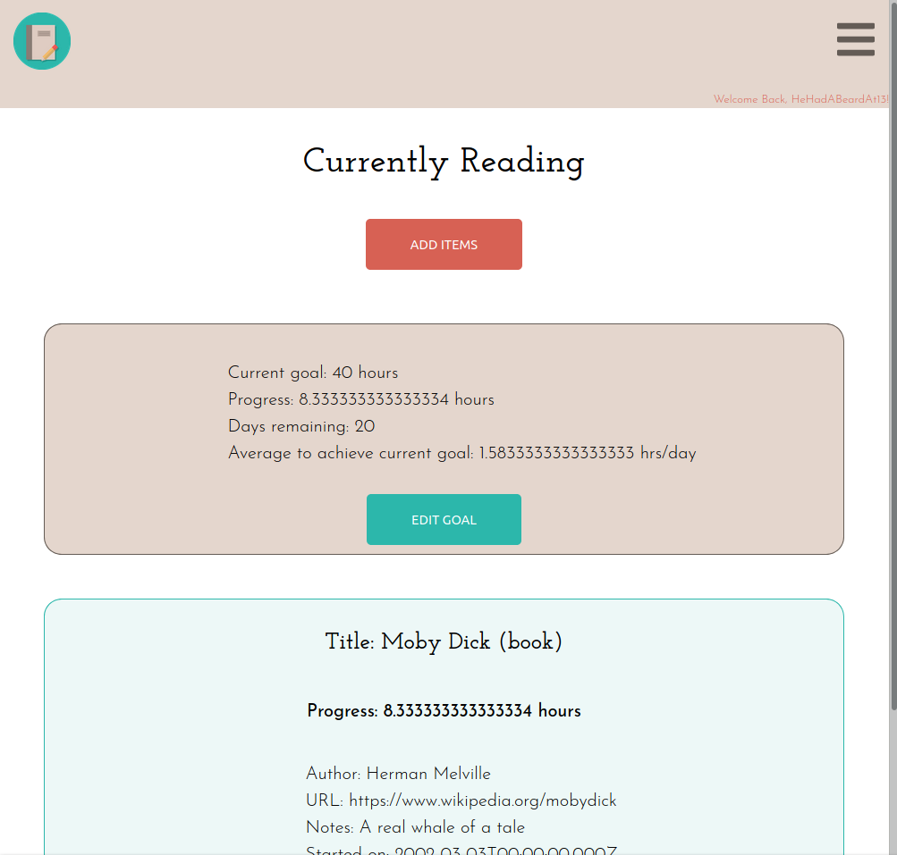
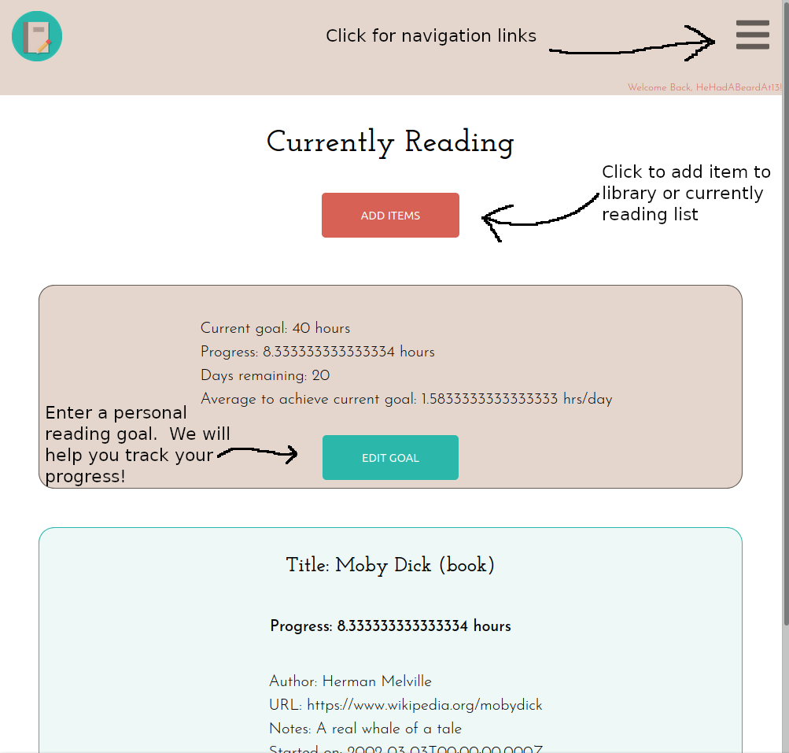
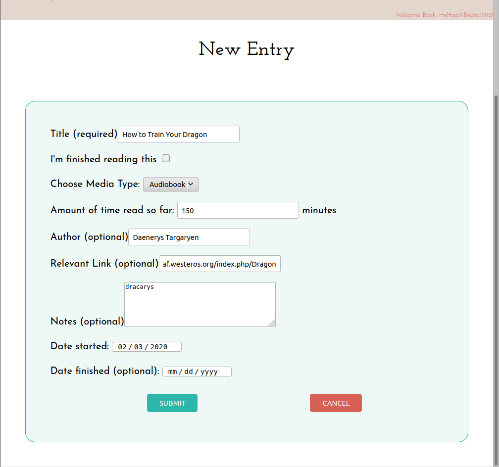
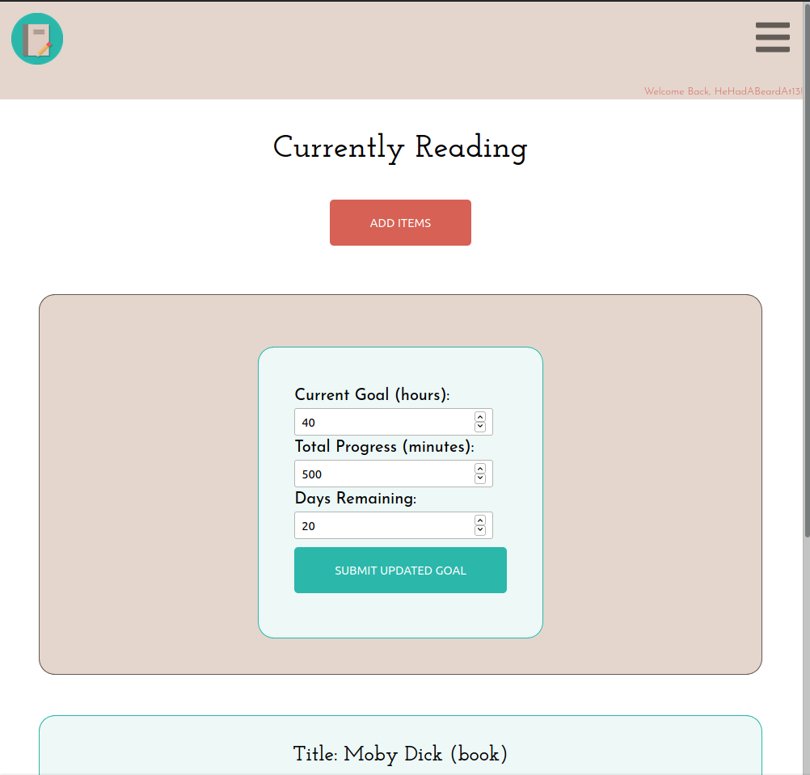
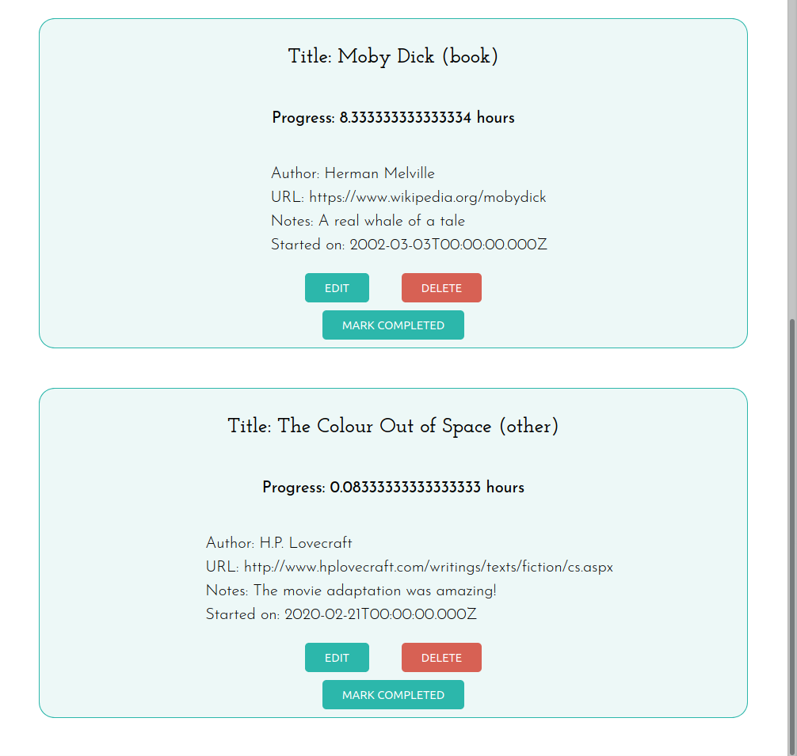
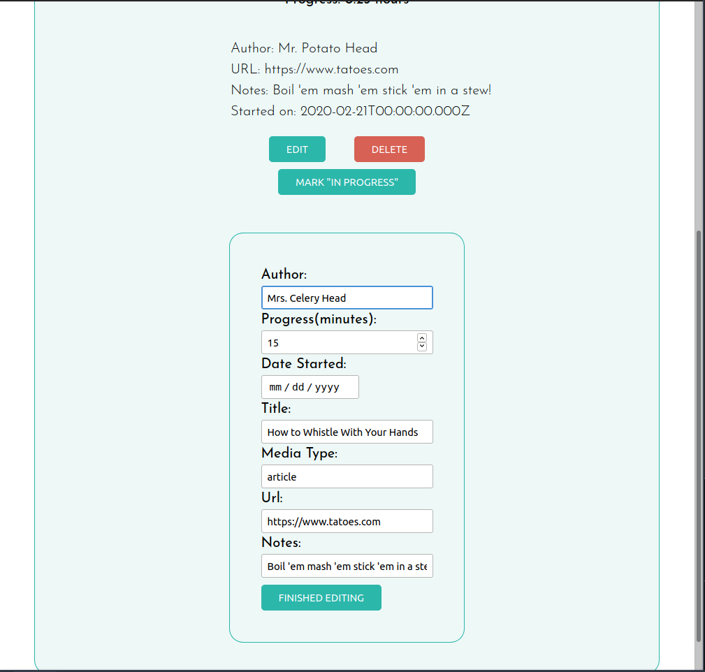

# Lexical Library
## *Read All the Things!*

**Lexical Library is an app for tracking and storing your reading habits.**

### [Live App](https://lexical-library.bladeboles.now.sh/) 

### Screenshots:

  
    
**LL is designed to be easy to use, but here are what some of the features do:**
  

  

**In case those beautiful annotations weren't clear, here's what those features look like in action:**
  

![New Entry View]
  
**Logging a new item**
  

  

**Editing your reading goals**

### More Screenshots:
  

  
  

  

**Click "Edit" or "Delete" on an item to update or remove it. Mark an item as "complete" or "in progress" to move it to the appropriate section.**
  

#### Upcoming Features

Lexical Library is a work in progress.  Here are some future features to expect:

* Items in "My Library" can be filtered and sorted by date completed and type of media
* Better time/date formatting, with the ability to choose units of time measure (minutes/hours/days/weeks)
* Stopwatch within each item that automatically updates your current progress
* Share goals and reading lists with friends!

#### Tech Stack
* Front End:  React, HTML5 & CSS3 (vanilla), JavaScript (ES6+)
* Back End: Node, PostgreSQL, Express
* Testing/Misc: npm, Mocha, Chai, Jest, Enzyme, SuperTest
* Deployment: Zeit (front-end), Heroku (api & database)

